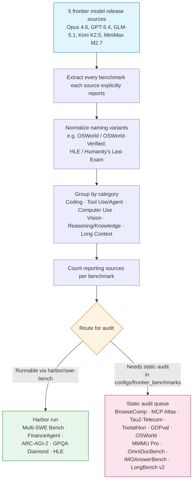

# How Benchmarks Are Chosen

```mermaid
flowchart TD
    A[5 frontier model release sources<br/>Opus 4.6, GPT-5.4, GLM-5.1, Kimi K2.5, MiniMax M2.7] --> B[Extract every benchmark each source explicitly reports]
    B --> C[Normalize naming variants<br/>e.g. OSWorld / OSWorld-Verified,<br/>HLE / Humanity's Last Exam]
    C --> D[Group by category<br/>Coding · Tool Use/Agent · Computer Use ·<br/>Vision · Reasoning/Knowledge · Long Context]
    D --> E[Count reporting sources per benchmark]
    E --> F{Route for audit}
    F -->|Runnable via harbor/swe-bench| G[Harbor run<br/>Multi-SWE Bench · FinanceAgent ·<br/>ARC-AGI-2 · GPQA Diamond · HLE]
    F -->|Needs static audit<br/>in configs/frontier_benchmarks| H[Static audit queue<br/>BrowseComp · MCP Atlas · Tau2-Telecom ·<br/>Toolathlon · GDPval · OSWorld ·<br/>MMMU Pro · OmniDocBench ·<br/>IMOAnswerBench · LongBench v2]

    style A fill:#e1f5ff,stroke:#0277bd
    style F fill:#fff4e1,stroke:#ef6c00
    style G fill:#e8f5e9,stroke:#2e7d32
    style H fill:#fce4ec,stroke:#c2185b
```

See [`frontier_model_benchmark_coverage.md`](./frontier_model_benchmark_coverage.md) for the full coverage table and source citations.
